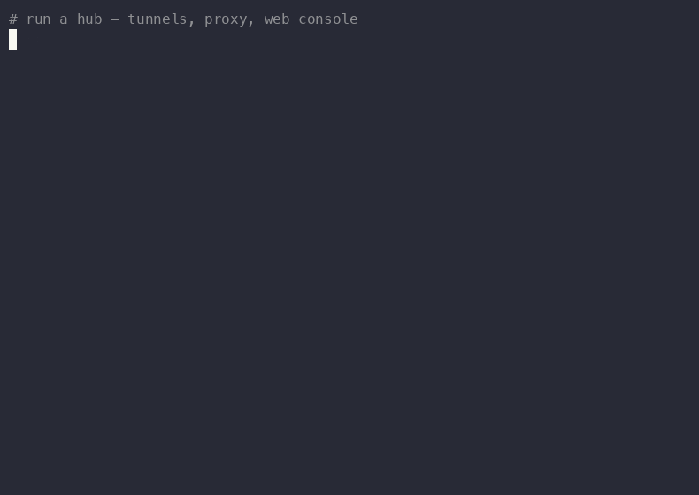
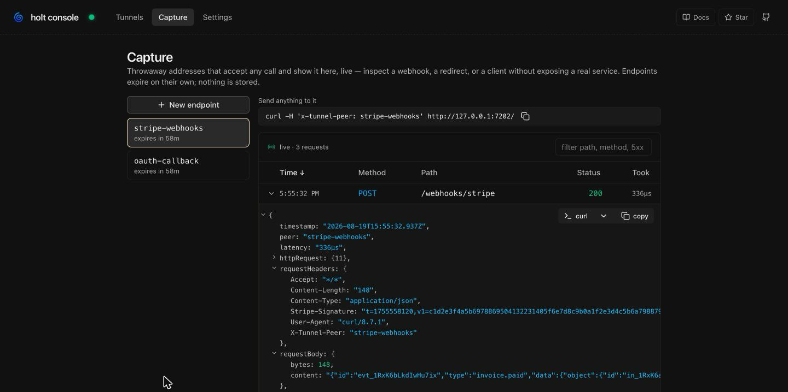
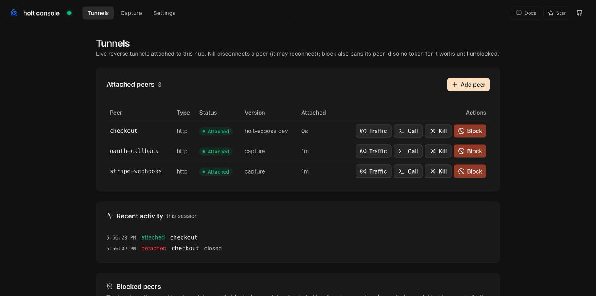
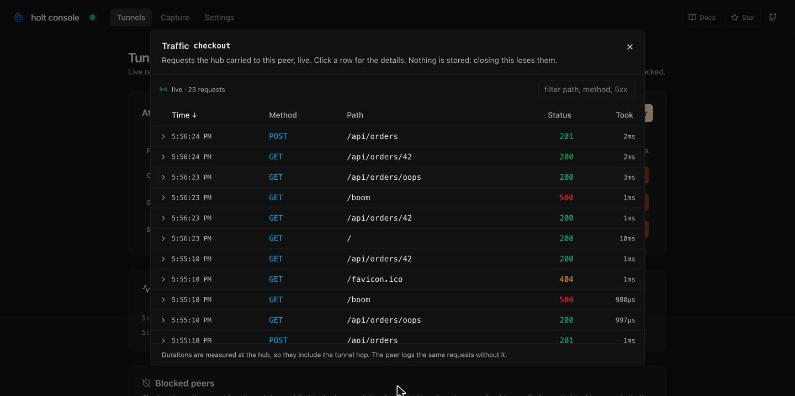

<div align="center">

# 🌀 holt

**Reverse HTTP tunnels for services that can only dial out.**

[](https://pkg.go.dev/github.com/openotters/holt)
[](https://goreportcard.com/report/github.com/openotters/holt)
[](LICENSE.md)
[](#)



</div>

Your service dials **out** to a hub, then serves a plain `http.Handler`
back through the connection it opened. Nothing listens, nothing is
published, no hole in the NAT. To the hub, the peer is just another
HTTP backend.

holt is a **Go library** first. The CLI is one opinionated packaging of
it... made for fun.

## Features

- 🕳️ **No inbound anything.** The peer only dials out. NAT, locked-down containers and field devices are fine.
- 🧩 **A library you embed.** Two constructors; the hub hands you an `http.RoundTripper` per peer, plus presence.
- ☁️ **Passes anywhere.** WebSocket carrier with JWT auth: Cloudflare, ingresses and access proxies just work.
- 🌐 **A hostname per peer.** `checkout.example.com` reaches the peer, so webhooks, OAuth callbacks and browsers work.
- 📦 **HTTP and gRPC** through the tunnel, with optional end-to-end TLS inside it.
- 🔎 **Live traffic view.** Headers, payloads and timings in the console; any request replays as `curl`.
- 🪤 **Capture endpoints.** Throwaway addresses that accept any call. Inspect a webhook without exposing a service.
- 🎛️ **Operable.** `ls` / `kill` / `block`, a web console, Prometheus metrics, a Grafana dashboard.
- 🚀 **Deploys small.** One binary, a Docker image, a Helm chart; several hubs share one PostgreSQL.

## Quick start

```sh
brew install openotters/tap/holt   # or: go install github.com/openotters/holt/cmd/holt@latest

holt hub --ui &                         # hub + console on 127.0.0.1:7201
holt expose localhost:3000 --peer web   # enrolls itself, serves the tunnel
curl -H 'x-tunnel-peer: web' http://127.0.0.1:7202/
```

Give peers real hostnames by fronting the hub with your TLS edge:

```sh
holt hub --advertise-addr wss://holt.example.com \
  --proxy-routing both --proxy-domain example.com
holt expose localhost:3000 --peer checkout
# https://checkout.example.com/ now reaches the service
```

## As a library

The peer attaches, serves your handler through the tunnel, and redials
with backoff:

```go
cl := holt.NewClient("wss://holt.example.com", myHandler, holt.WithBearerToken(token))
err := cl.Run(ctx)
```

The hub is one call, and every peer becomes an ordinary HTTP backend:

```go
srv := holt.NewServer(
	holt.WithTunnel(holt.NewTunnel(":7200", holt.WithAuthBearer(peerForToken))),
	holt.WithProxy(holt.NewProxy(":7202")),
)
go srv.Run(ctx)

client := &http.Client{Transport: srv.Registry().RoundTripper(peerID)}
```

Bring your own auth, middleware, listeners and storage. Everything the
CLI adds is built on this surface. See [Library](docs/library.md) and
[How it works](docs/architecture.md).

## The console

`holt hub --ui`. Point a Stripe webhook at a capture endpoint and read
it, signature and payload included, without exposing anything:

<div align="center">
  
</div>

<p align="center">
  
  
</p>

## When to pick something else

frp, ngrok and inlets do more, at a bigger scale: TCP/UDP, load
balancing, teams, hosted service. holt is HTTP(S) and gRPC through one
hub on your own infra, and a library to embed. If that is your case,
everything stays yours.

> ⚠️ Alpha, extracted from [openotters](https://github.com/openotters/openotters),
> where it is the daemon-to-agent channel. The wire protocol may still change.

## Documentation

| | |
|---|---|
| **Get started** | [Install](docs/install.md) · [How it works](docs/architecture.md) |
| **Use holt** | [CLI](docs/cli.md) · [Web console](docs/console.md) |
| **Operate** | [Security](docs/security.md) · [Kubernetes](docs/kubernetes.md) · [Observability](docs/observability.md) |
| **Build with holt** | [Library](docs/library.md) · [Examples](docs/examples.md) · [Development](docs/development.md) |

## License

[MIT](LICENSE.md)
