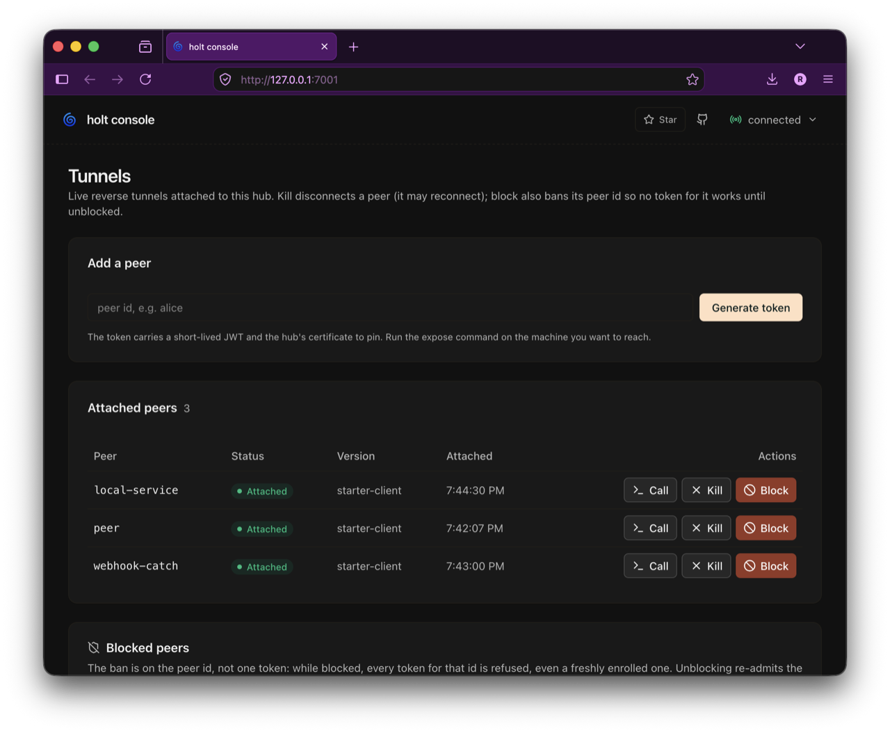

<div align="center">

# 🌀 holt

**Reverse HTTP tunnels for services that can only dial out.**

[](https://pkg.go.dev/github.com/openotters/holt)
[](https://goreportcard.com/report/github.com/openotters/holt)
[](LICENSE.md)
[](#)

</div>

A *holt* is an otter's den: a burrow in the riverbank, reachable only
through the underwater tunnel its owner dug. Same idea here. A **peer**
that cannot accept inbound connections (behind NAT, in a locked down
container, on a field device) dials out to a **hub**, then serves an
ordinary `http.Handler` back through the connection it opened. The hub
gets an `http.RoundTripper` per peer, and a presence signal for free.

No listener, no inbound port, no published container port on the peer.

> ⚠️ Alpha, extracted from [openotters](https://github.com/openotters/openotters)
> where it is the sole daemon-to-agent-runtime channel. The wire protocol
> may still change.

<div align="center">
  
  <br />
  <sub>The built-in web console (<code>holt hub --ui</code>). See <a href="docs/console.md">Web console</a>.</sub>
</div>

## Where holt fits

frp, ngrok and inlets do much more than holt, and at a bigger scale. If
you need TCP or UDP forwarding, load balancing, teams and quotas, or a
hosted service with support, look at them first.

holt is for simpler needs. You have an HTTP service that can only dial
out, you have a domain and a small server (or a Kubernetes cluster), and
you want to reach that service without giving your traffic to somebody
else. One binary for the hub, one command on the peer, and everything
stays yours.

What you get:

- HTTP and gRPC through the tunnel, the peer serving an ordinary handler
- a hostname per peer, so a browser, a webhook or an OAuth callback can
  reach it directly
- a WebSocket transport, so the tunnel passes through Cloudflare,
  ingresses and access proxies (gRPC does not pass there)
- a web console, Prometheus metrics and a Grafana dashboard
- a Helm chart, and a shared PostgreSQL when you run several hubs

## Quickstart (local)

Install it (see [all install methods](docs/install.md)):

```sh
brew install openotters/tap/holt      # or: go install github.com/openotters/holt/cmd/holt@latest
```

Expose a local service through a hub in two commands:

```sh
holt hub --ui &                  # run a hub (web console on 127.0.0.1:7201)
holt expose localhost:3000 --peer web   # enrolls itself, then serves the tunnel
```

Then reach the peer *through* the hub:

```sh
curl -H 'x-tunnel-peer: web' http://127.0.0.1:7202/
```

Drop `--peer` and it enrolls under a generated name (`cosy-eddy-aec23e`); from another
machine, point it at the hub with `--admin-url` or a `--profile`. For
a long-lived peer, mint the token once with `holt enroll web` and pass
it with `--token`.

The token bundles the peer's JWT and the hub's tunnel URL. Peers
authenticate with the JWT and attach over a **WebSocket**, so the
tunnel passes through anything that can proxy plain HTTP: CDN public
hostnames (Cloudflare included), access proxies, ordinary ingresses.
The URL's scheme picks the transport: a `wss://` URL is encrypted by a
TLS edge in front of the hub (an ingress, LoadBalancer, or Cloudflare),
while `ws://` dials plaintext for local use (`https://`/`http://` are
accepted as aliases). The hub itself never manages a certificate.

Behind a TLS edge, advertise the public URL so peers dial it over TLS:

```sh
holt hub --advertise-addr wss://holt.example.com &   # hub is plaintext; your edge terminates TLS
holt enroll web                                      # token now carries the wss URL
```

See [Security](docs/security.md) for exposing a hub safely.

## Examples

Give a peer its own hostname, for a webhook, an OAuth callback, or just
a browser. Point a wildcard record at the proxy first (keep the peers at
the first level of the domain, a wildcard certificate covers only one
level):

```sh
holt hub --advertise-addr wss://holt.example.com \
  --proxy-routing both --proxy-domain example.com

holt expose localhost:3000 --peer checkout
# https://checkout.example.com/ now reaches the service
```

Expose an appliance that serves HTTPS with a self signed certificate (a
router, a NAS, an IPMI card):

```sh
holt expose https://192.168.1.1 --insecure --peer router
```

Open a quick tunnel without choosing a name:

```sh
holt expose localhost:8080
# it enrolls itself, as something like cosy-eddy-aec23e
```

From another machine, say where the hub is (or put it in a
[profile](docs/cli.md#remote-hubs-and-profiles)):

```sh
holt expose localhost:3000 --admin-url https://holt.example.com
```

Then operate the hub:

```sh
holt ls           # who is attached
holt kill web     # close a tunnel, the peer may come back
holt block web    # ban the peer id until you unblock it
```

On Kubernetes, the chart runs the hub, and several hubs can share one
PostgreSQL for presence, blocklist and signing identity:

```sh
helm install holt oci://ghcr.io/openotters/charts/holt
```

See [Kubernetes](docs/kubernetes.md) for the fleet setup, the ingresses
and the Grafana dashboard.

## Documentation

Full docs live in [`docs/`](docs/README.md):

- **Get started**: [Install](docs/install.md) · [How it works](docs/architecture.md)
- **Use holt**: [CLI](docs/cli.md) · [Web console](docs/console.md)
- **Operate**: [Security](docs/security.md) · [Kubernetes](docs/kubernetes.md) · [Observability](docs/observability.md)
- **Build with holt**: [Library](docs/library.md) · [Examples](docs/examples.md) · [Development](docs/development.md)

## License

[MIT](LICENSE.md)
